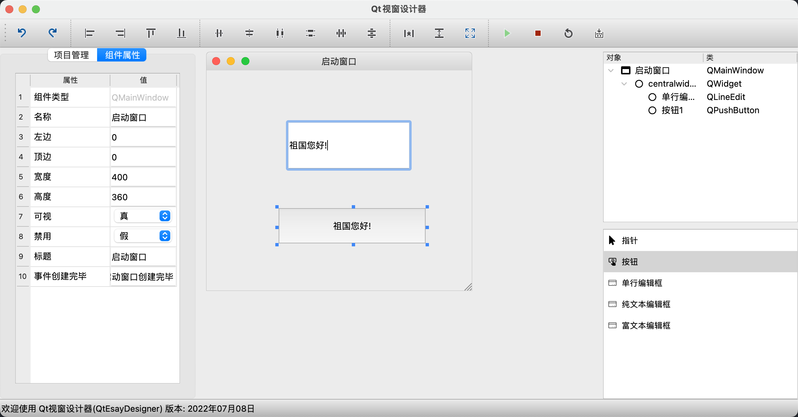
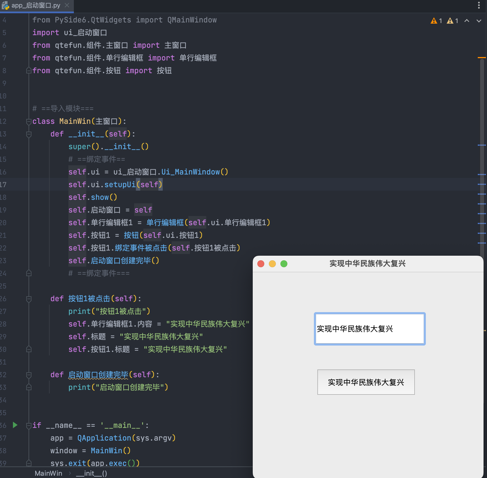

# Qt Esay Designer (Qt窗口设计器)

## 仍在积极开发中


一款为中国人入门 python 编程的产品

配备完整的视窗软件开发生态集成 `开发` `编译` `可视化界面设计` 轻松拖拽组件设计界面，一键编译发布。

支持跨平台可视化窗口程序开发，`window`  `mac OS`  `ubuntu` ，实现一套代码多端运行。


## 优势

* **会中文就看得懂**，中文编程，得天独厚，简单，易用。
* **最强开发工具** `Pycharm` 中文软件界面，拼音输入，智能提示。
* **界面设计器**，易函数视窗可视化设计器，轻松拖拽组件，设计界面，所见即所得。
* **中文函数库**， [qtefun](https://github.com/duolabmeng6/qtefun) 全中文函数库，专门为 qt 封装的中文组件，以易语言核心支持库组件库为标准封装的界面库，组件的方法，属性，事件，都是令人熟悉的命名。
* **组件中文命名** 易于理解和使用
* **一键编译**，可执行程序， 支持跨平台编译`window` `macOS` `linux`，易函数提供一键编译功能将任意python代码，转换为 c 编译的可执行程序






# 软件下载

由于在积极开发所以请及时关注新版本发布哦

支持 MacOS Window

[点击这里下载Qt视窗设计器](https://github.com/duolabmeng6/QtEasyDesigner/releases)

## 配置 pycharm 插件

提供 pycharm 插件以方便使用  [点击下载 QtEasyDesigner.IDE.jar](https://github.com/duolabmeng6/QtEasyDesigner/releases/download/0.0.56/QtEasyDesigner.IDE.jar)

mac配置路径 `/Applications/QtEasyDesigner.app/Contents/MacOS/QtEasyDesigner`

window配置路径为 `exe文件路径`

# 使用帮助

本设计器所生成的 `ui_启动窗口.py` 可以兼容原版qt的按正常规则引入界面即可

qtefun 的模块下载后放置到项目目录 https://github.com/duolabmeng6/qtefun

后续会提供 `pip install qtefun` 或者直接写到项目目录的形式~

```text
.
├── app_启动窗口.py 主入口文件
├── qtefun  这是中文组件库
├── ui_启动窗口.py ui设计py文件
└── 启动窗口.json ui配置文件

```

# 参与开发 

## 开发环境 配置

```shell
git clone https://github.com/duolabmeng6/QtEasyDesigner.git --recurse-submodules
```

* 子模块 qtefun 这是组件库是中文的命令 https://github.com/duolabmeng6/qtefun
* 子模块 pyefun 这是各种功能类的中文命令 https://github.com/duolabmeng6/pyefun


需要开发的
* qt_esay_model/组件库 这里是指软件中的 组件箱 配置好即可出现在组件箱
* qtefun/组件 这里是组件的中文命令 这个库可以用于官方的qt设计器

源码运行设计器 需要注意 python3.9 需要绝对路径

```shell
/usr/local/bin/python3.9 /QtEasyDesigner/QtEasyDesigner.py
```


